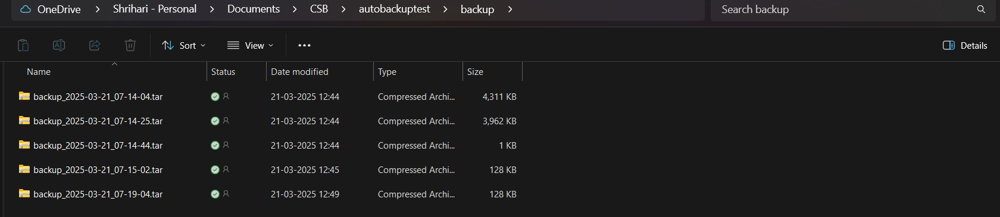

# FILE AUTO BACKUP

This project contains two shell scripts to automate the backup process of a specified directory.

## Scripts

### 1️⃣ `backup_script.sh`

This script creates a compressed backup (`.tar.gz`) of a specified directory and saves it in a backup directory with a timestamped filename.

- **Usage:** Can be scheduled to run at specific intervals using **cron jobs**.
- **Example Cron Job (Runs Every Hour):**
  ```sh
  0 * * * * /path/to/backup_script.sh
  ```

### 2️⃣ `backup_script_loop.sh`

This script runs **continuously**, creating a backup every **1 hour** using a `while` loop.

- **Usage:** Runs in the background and automatically creates backups at regular intervals.
- **Execution:**
  ```sh
  chmod +x backup_script_loop.sh
  ./backup_script_loop.sh
  ```

## How It Works

1. The script defines a **source directory** to back up and a **backup directory** where compressed files will be stored.
2. A timestamped filename is created (`backup_YYYYMMDD_HHMMSS.tar.gz`).
3. The script uses `tar -czf` to create a compressed backup.
4. In `backup_script_loop.sh`, a `while true` loop ensures the process runs indefinitely, creating backups every hour.

## Notes

- Ensure the script has **execute permissions** (`chmod +x`).
- Modify the **source and backup directory paths** as needed.
- If using `backup_script.sh`, remember to set up a cron job to automate execution.

Happy Backing Up! 🚀

## Backup Results Screenshot

